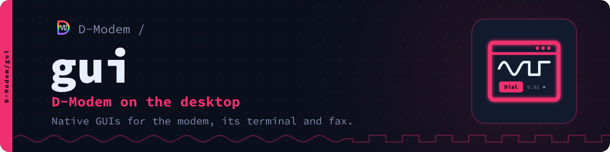
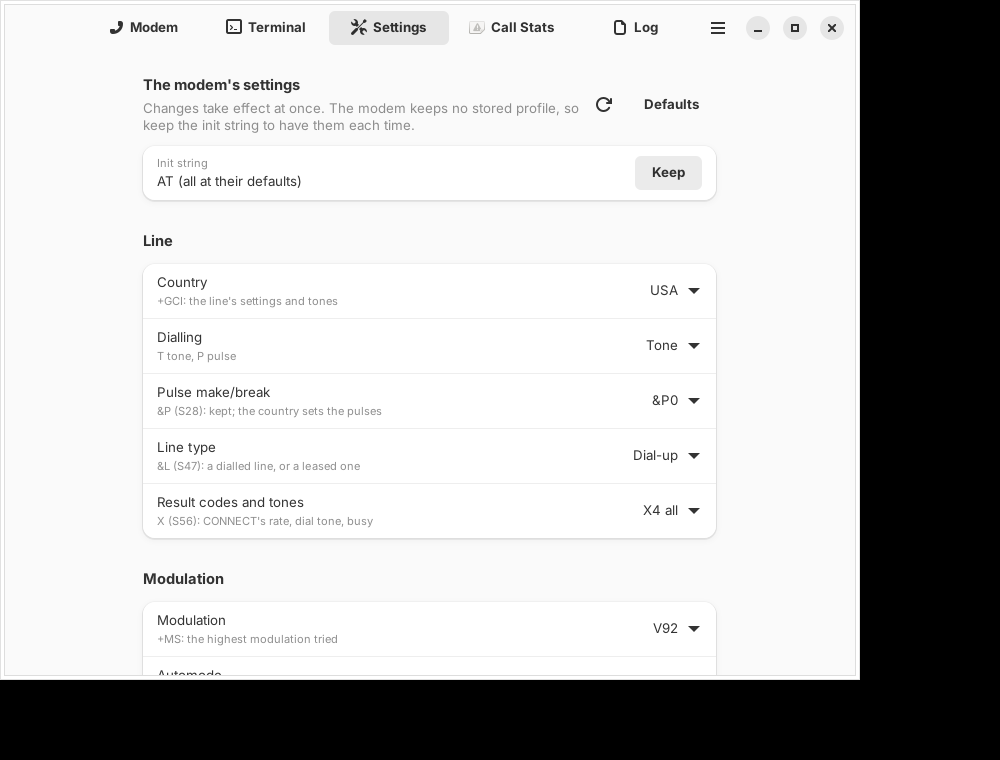

# D-Modem desktop apps

Native apps for D-Modem on Windows, macOS and Linux. The site of the apps is
<https://d-modem.github.io/gui/>.

The apps have the modem built in, so they need no dmodemd (refer to
[The built-in modem](docs/embedded-modem.md)). Each app
shows the modem as a desktop program. You can dial and answer from a window,
change the settings without AT commands, and see the results of the last
call. All three apps are thin native shells over one small C library,
libdmodemctl. Thus they operate in the same way.

- **Modem**: the state of the call, dial, answer and hang up, and the line that the modem uses
- **Phone**: voice calls through the sound card (dial, answer, keypad), and an
  answering machine that takes messages on this computer when you enable it (disabled by default)
- **Terminal**: the AT console, and the setup screens of the modem (AT!CF, AT!CT)
- **Remote**: log in to a server by SSH, Telnet or rlogin, in a separate terminal. SSH is built in, on libssh, and it uses the keys and the agent of OpenSSH and PuTTY
- **Terminal types**: the terminal emulator of the D-Modem app, ported to C: xterm, DEC VT52 to VT525, ANSI-BBS, PETSCII, ATASCII, Viewdata, Minitel and Tektronix 4014, with sixel, ReGIS and Tektronix graphics
- **The Windows app**: file transfers (ZMODEM, YMODEM, XMODEM and Kermit), copy and capture, and the ASCII Setup, Terminal Settings and Call menu of HyperTerminal. Refer to [Features](docs/features.md)
- **Settings**: each modem setting as a native control, from AT!M
- **Call Stats**: the rate, modulation, error control and line figures of the last call (AT#UD, ATI11)
- **Line settings**: a SIP account, a USB modem, or a modem that already runs (dmodemd, or a hardware modem such as the MultiTech MT9234MU)
- **Windows 95 and later**: plain Win32, built with [clang-retro](https://clang-retro.github.io/). The modem is built in on each Windows. The app can also connect to a modem through TCP or a COM port
- **The Windows app on Linux and macOS**: the same Win32 code, built over the portable Win32 layer of [clang-retro MFC](https://github.com/clang-retro/mfc). It starts dmodemd, or connects to a modem through TCP or a COM port. Refer to "The Windows app on Linux and macOS" in [Design](docs/design.md)

| | Windows | macOS | Linux |
| --- | --- | --- | --- |
| Toolkit | Win32, C++ | SwiftUI | GTK 4, libadwaita |
| Runs on | Windows 95 and later | macOS 13 and later | GTK 4.10 and libadwaita 1.5 or later (Ubuntu 24.04, Fedora 40) |

 

 

## Nightly builds

The [nightly release](https://github.com/D-Modem/gui/releases/tag/nightly)
has the apps from the newest build of `main`. It has the Windows app (for
Windows 95 and later, and for Windows 7 and later), the Linux app, the
macOS app, and the Windows app for Linux and macOS. A workflow
(`.github/workflows/nightly.yml`) replaces the release one time each day.
When `main` has no new commits, the release does not change. When the
main branch of D-Modem changes, a workflow moves the built-in modem to it
and builds the apps again (refer to [Building](docs/building.md)).

These builds are not stable releases. The files are not signed. Thus
Windows and macOS can show a warning before the app starts.

## Quick start

Linux:

    sudo apt install cmake libgtk-4-dev libadwaita-1-dev libpulse-dev \
        libsndfile1-dev
    cmake -S . -B build && cmake --build build && ./build/linux/dmodem-gui

For Windows (with clang-retro), macOS, and the Windows app on Linux and
macOS, refer to [Building](docs/building.md).

## Documentation

- [The site](https://d-modem.github.io/gui/): the home page, the downloads and all the pages below
- [Features](docs/features.md): each page and menu of the apps, with the details of the Windows app
- [Building](docs/building.md): Linux, Windows with clang-retro, macOS, and the Windows app on Linux and macOS
- [The built-in modem](docs/embedded-modem.md): the modem inside the Linux and Windows apps, with no dmodemd
- [Design](docs/design.md): how the apps are built, what they share, hardware modems (the MultiTech MT9234MU), the Windows 9x notes, and the Windows app on Linux and macOS
- [libdmodemctl](core/include/dmodemctl.h): the API of the library
- [Documentation style](docs/STYLE.md): the rules for ASD-STE100 Simplified Technical English

## The D-Modem suite

| Repository | What it is |
| --- | --- |
| [D-Modem](https://github.com/D-Modem/D-Modem) | The open V.92 softmodem: dmodemd, libdmodem and the Asterisk, FreeSWITCH and ARI modules |
| [app](https://github.com/D-Modem/app) | The D-Modem app for Android and iOS: a dial-up modem on a SIP call |
| [gui](https://github.com/D-Modem/gui) | D-Modem on the desktop: native apps for Windows, macOS and Linux |
| [hardware](https://github.com/D-Modem/hardware) | pico-serial: RP2040 serial adapters and phone-line USB sticks |
| [login](https://github.com/D-Modem/login) | dmodem-login: the login, menu and LDAP provider for dial-up callers |
| [bbs](https://github.com/D-Modem/bbs) | A bulletin board for telnet, SSH, TN3270 and modem callers |
| [go3270](https://github.com/D-Modem/go3270) | A Go library for 3270 terminal servers, used by bbs |
| [brand](https://github.com/D-Modem/brand) | Logos, colours, type and the naming guide |

## Licence

AGPL-3.0-only ([LICENSE](LICENSE)), or a commercial licence from the D-Modem Authors ([COMMERCIAL-LICENSE.md](COMMERCIAL-LICENSE.md)). Contributions come with a contributor agreement ([CONTRIBUTING.md](CONTRIBUTING.md)).
